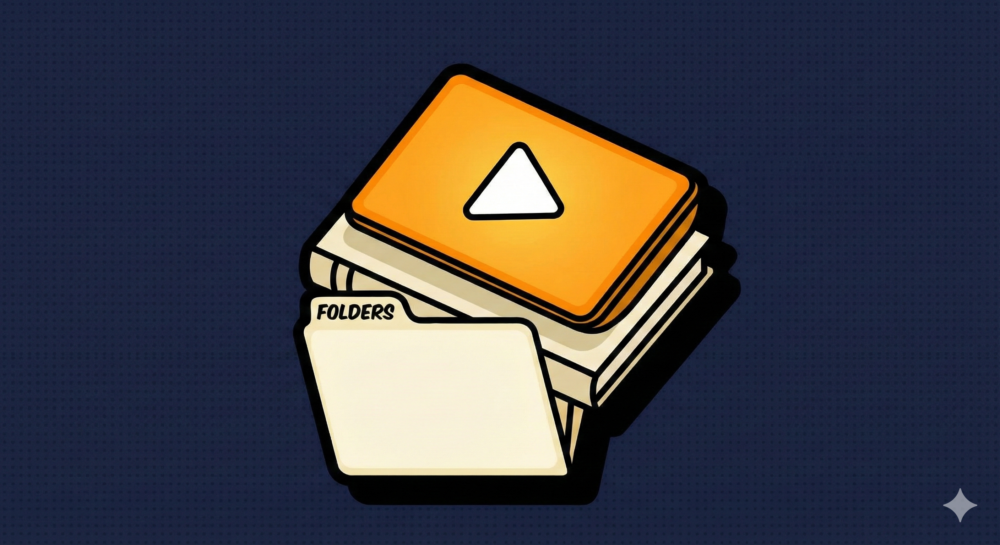

<div align="center">
  
  <h1>Inkwell</h1>
  <p><strong>Personal Local Learning Management System (LMS)</strong></p>
  
  [](https://opensource.org/licenses/MIT)
  [](#)
</div>

---

> [!IMPORTANT]
> **Inkwell** is a fully local, personal Learning Management System designed to turn your scattered video course folders into a structured, trackable learning environment — with a unique cartoon-inspired aesthetic!

## ✨ Key Features

- 🖍️ **Cartoon Design System** — A bold, hand-drawn UI style with thick outlines and cel-shading.
- 📂 **Auto-Scan Magic** — Recursively imports video folders and builds a clean curriculum automatically.
- 🎥 **Pro Video Player** — Custom controls, HTTP range streaming (seamless seeking), and subtitle support.
- 📊 **Learning Stats** — Track your daily streaks, hours watched, and weekly progress with beautiful charts.
- 📑 **Bookmarks & Notes** — Save exact timestamps and take per-lesson notes that auto-save while you learn.
- 🔒 **100% Privacy** — Your data stays on your machine. No accounts, no cloud, no tracking.

## 🚀 Quick Start

Ensure you have [Node.js](https://nodejs.org/) installed, then run:

```bash
# Install everything (Root, Client, and Server)
npm run install:all

# Start the engine!
npm run dev
```

- **Frontend:** [http://localhost:5173](http://localhost:5173)
- **Backend API:** [http://localhost:3001](http://localhost:3001)

## 🛠️ Tech Stack

| Layer | Technology |
|---|---|
| **Frontend** | React + Vite + Framer Motion |
| **Styling** | Tailwind CSS + Custom Comic Tokens |
| **State** | Zustand |
| **Database** | SQLite (better-sqlite3) |
| **Server** | Node.js + Express |

## 🎨 Design Philosophy

Inkwell isn't just a tool; it's a sketchbook for your mind. Every border is a **thick ink line**, every shadow is a **solid offset**, and every interaction is designed to feel **tactile and alive**.

---

<p align="center">
  Built with ❤️ for learners who value their local data.
</p>
